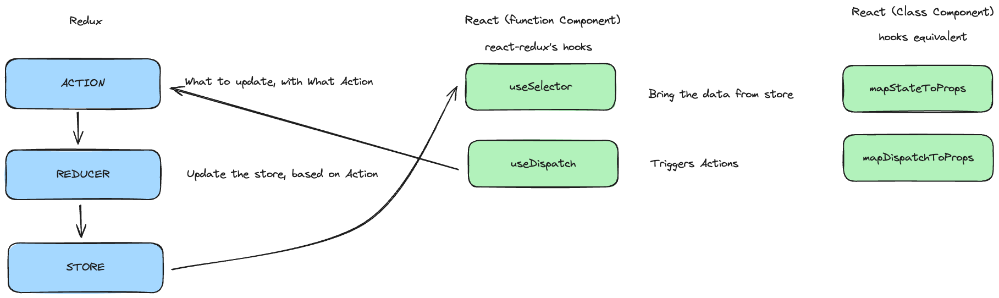
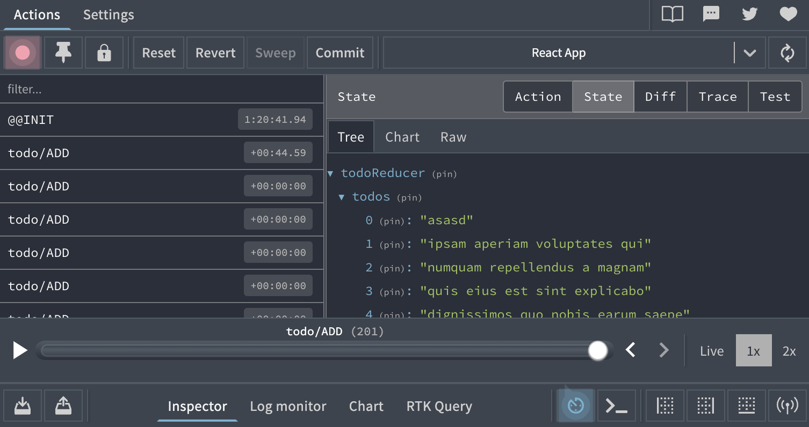

# About this todo app with Redux
- this app uses functional components and react-redux hooks `useSelector` and `useDispatch`
- there is another repo https://github.com/rohanchandane/react-redux-todo using class component with `mapStateToProps` and `mapDispatchToProps`

# Redux - React


# How React-Redux works?
- Using Redux
    
    ```jsx
    npm install redux
    ```
    
- Create Store (& Adding Reducer to Store)
    
    ```jsx
    import { createStore, combineReducers } from 'redux';
    
    import { todoReducer } from './reducer/todo';
    
    // create store and mention which reducers are going to update it
    const store = createStore(combineReducers{ todoReducer });
    
    export default store;
    ```
    
- Create Reducer
    
    ```jsx
    
    const initialState = {
    	todos: []
    } 
    
    export default function todoReducer(state=initialState, action) {
    	const {type, payload} = action;
    	
    	switch (type) {
    		case 'ADD':
    			state.todos = [payload, ...state.todos]
    			return { ...state }
    	
    		default:
    			return state;
    	}
    }
    ```
    
- Create Action
    
    ```jsx
    export function addTodoAction(payload) {
    	return {
    		type: 'ADD',
    		payload: payload
    	}
    }
    ```
    
- Connecting Redux with React
    
    ```jsx
    npm install react-redux
    ```
    
    - Connecting Redux `store` with React (`index.js`)
        
        ```jsx
        import { Provider } from 'react-redux';
        .
        .
        <React.StrictMode>
        	<Provider store={store}>
        		<App/>
        	</Provider>
        </React.StrictMode>
        ```
        
    - Trigger `action` with `payload` using `useDispatch` hook in a Component `App.js`
        
        ```jsx
        import { useDispatch } from 'react-redux';
        import { addTodoAction } from './store/action/todo';
        .
        .
        const dispatch = useDispatch();
        .
        .
        // on event handler
        handleAddToTodo() {
        	dispatch(addTodoAction("payload data");
        }
        ```
        
    - Component subscribing to `store` for state update using `useSelector` hook in a Component `App.js`
        
        ```jsx
        import { useSelector } form 'react-redux';
        .
        .
        const todoState = useSelector((state) => {
        	return state.todoReducer.todos;
        });
        .
        .
        {
        	todoState?.map( (item, index)=> {
        		<h3 key={index}> {item} </h3>
        	});
        }
        ```
        
- Creating multiple Reducers
- Middleware: Redux-Thunk
    - Meaning: adding extra functionality to existing function
    - What if I want to perform any Async work like API call to update store state, calling browser APIs (access local storage, cookies)
    - Using `redux-thunk` middleware
        
        ```jsx
        npm install redux-thunk
        ```
        
    - applying this middleware for `store` . (`store/index.js`)
        
        ```jsx
        import { createStore, combineReducers, applyMiddleware } from 'redux';
        import { thunk } from 'redux-thunk';
        .
        .
        const store = createStore( combineReducers({todoReducer}), applyMiddleware(thunk) );
        ```
        
    - using middleware in `action`  in `/action/todo/index.js`
        
        ```jsx
        export function addTodoAfterDataFetchAction(todo) {
        	return function(trigger) {
        		// async call
        		// then trigger orignal action to update store
        		trigger(addTodoAction(todo));
        	}
        }
        ```
        
    - calling `addTodoAfterDataFetchAction` action from Component instead of previous action `addTodoAction`
        
        ```jsx
        import { addTodoAction, addTodoAfterDataFetchAction } from './store/action/todo';
        .
        .
        function handleAddTodo() {
        	dispatch(addTodoAfterDataFetchAction(inputValue))
        }
        ```
        
    - Alternative: Redux-Saga: has more features than thunk
- Redux Dev Tool
    - https://github.com/reduxjs/redux-devtools
    - Connecting Devtool with `store`
        
        ```jsx
        npm install @redux-devtools/extension
        ```
        
    - Using it with React-Redux app and then open Chrome Redux Dev Tool
        
        ```jsx
        import { composeWithDevTool } from '@redux-devtools/extension';
        .
        .
        const store = createStore(combineReducers({}), composeWithDevTool(applyModdleware(thunk)));
        ```
    - Redux dev tool 
    
# Getting Started with Create React App

This project was bootstrapped with [Create React App](https://github.com/facebook/create-react-app).

## Available Scripts

In the project directory, you can run:

### `npm start`

Runs the app in the development mode.\
Open [http://localhost:3000](http://localhost:3000) to view it in your browser.

The page will reload when you make changes.\
You may also see any lint errors in the console.